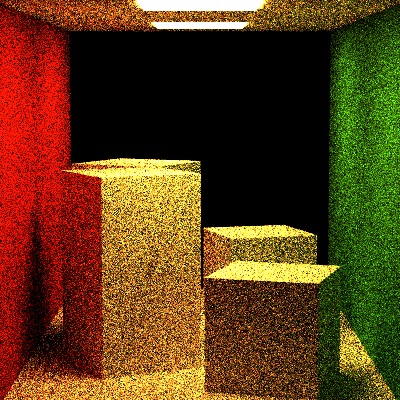
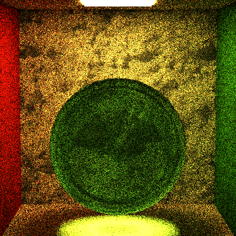
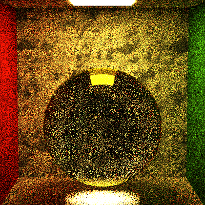
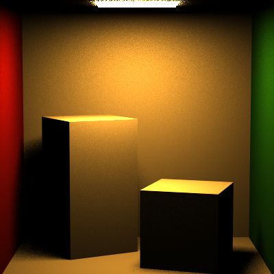
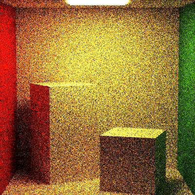

Path Tracer Episode II: Attack of the Mirrors
======================

**University of Pennsylvania, CIS 561: Advanced Computer Graphics, Homework 5**

Overview
------------
You will implement two separate components for your path tracer: a new
`Integrator` class to estimate the direct lighting in a scene by sampling points
on light surfaces, and a collection of `BxDF`s to handle specular reflective and
transmissive materials. You may implement and test these features in any order
you see fit.

We have provided you with updated and new files for your existing path tracer
base code. Please copy your existing files into the assignment_package folder,
but __DO NOT__ replace any of the files we have provided with this assignment.
For some of your files, you may have to add function implementations to
various files to make your project compile again. However, just to re-iterate,
it is vital that you __DO NOT__ replace any of the files we have given you
for this assignment.

Useful Reading
---------
Once again, you will find the textbook will be very helpful when implementing
this homework assignment. We recommend referring to the following chapters:
* 5.5: Working With Radiometric Integrals
* 8.2: Specular Reflection and Transmission
* 14.1.3: Specular Reflection and Transmission
* 14.2: Sampling Light Sources
* 14.3: Direct Lighting

The Light Transport Equation
--------------
#### Lo(p, &#969;o) = Le(p, &#969;o) + &#8747;S f(p, &#969;o, &#969;i) Li(p, &#969;i) V(p', p) |dot(&#969;i, N)| _d_&#969;i

* __Lo__ is the light that exits point _p_ along ray &#969;o.
* __Le__ is the light inherently emitted by the surface at point _p_
along ray &#969;o.
* __&#8747;S__ is the integral over the sphere of ray
directions from which light can reach point _p_. &#969;o and
&#969;i are within this domain.
* __f__ is the Bidirectional Scattering Distribution Function of the material at
point _p_, which evaluates the proportion of energy received from
&#969;i at point _p_ that is reflected along &#969;o.
* __Li__ is the light energy that reaches point _p_ from the ray
&#969;i. This is the recursive term of the LTE.
* __V__ is a simple visibility test that determines if the surface point _p_' from
which &#969;i originates is visible to _p_. It returns 1 if there is
no obstruction, and 0 is there is something between _p_ and _p_'. This is really
only included in the LTE when one generates &#969;i by randomly
choosing a point of origin in the scene rather than generating a ray and finding
its intersection with the scene.
* The __absolute-value dot product__ term accounts for Lambert's Law of Cosines.

`MirroredMaterial` Class
-------------------
We have provided you with a `MirroredMaterial` class that represents perfectly
specular reflective surfaces, and will generate a single `SpecularBRDF` any time
it invokes `GenerateBSDF`. You can load the `PT_mirrorBox.json` scene file to
test your specular BRDF implementation.

Updating `BSDF::Sample_f` (5 points)
-------
Add code to `BSDF::Sample_f` that checks if the randomly chosen `BxDF` is
specular, and skips the portions of `BSDF::Sample_f` that iterate through all
`BxDF`s and computes their `f`s and `Pdf`s if the chosen `BxDF` is specular.
This skip check must be done because specular materials have a delta
distribution for their PDFs and as such we make certain assumptions about how
they are integrated into the light transport equation that should not be made
for other materials. We will discuss this more in depth in class.

`SpecularBRDF` Class (8 points)
-----------
You must implement the `Sample_f` function of the `SpecularBRDF` class. Since
this BRDF is perfectly specular, `Sample_f` should generate &#969;i
by reflecting &#969;o about the surface normal. Remember,
`BxDF::Sample_f` is performed in tangent space, so the surface normal is always
(0, 0, 1), making reflection about the normal very simple. Note that we have
already "implemented" `f` and `Pdf` for you; these both return 0. This is
because we will assume that &#969;i has a zero percent chance of
being randomly set to the exact mirror of &#969;o by any other
`BxDF`'s `Sample_f`, hence a PDF of zero.

You can test if your `SpecularBRDF` implementation works by rendering
`PT_mirrorBox.json`. Your image should look like this, given default sample and
recursion settings with the Naive Integrator:

`SpecularBTDF` Class (12 Points)
-------------
Like for the `SpecularBRDF` class, you must implement the `Sample_f` function of
the `SpecularBTDF` class. This function is a little more involved, however, as
you not only must generate &#969;i by refracting &#969;o,
but you must also check for total internal reflection and return black if it
would occur. Remember, this class only handles transmission, so it should not
compute the color that would be returned by total internal reflection if it were
to be simulated. You must also make sure to check whether your ray is entering
or leaving the object with which it has intersected; you can do this by
comparing the direction of &#969;o to the direction of your normal
(remember, you are in tangent space so this is pretty easy). If your ray is
leaving a transmissive object, you should compute its index of refraction as
etaB / etaA rather than the other way around.

You can test if your `SpecularBTDF` implementation works by rendering
`PT_transmitBox.json`. Your image should look like this, given default sample and
recursion settings with the Naive Integrator:

`FresnelDielectric` Class (8 points)
------------
In `fresnel.h` you will find several classes declared, the first of which is
simply `Fresnel`. The other classes, `FresnelNoOp`, `FresnelNoReflect`, and
`FresnelDielectric`, all inherit from this abstract class. Each of these classes
is designed to compute the Fresnel reflection coefficient at a given point of
intersection on a surface. For surfaces that are less physically accurate, such
as entirely reflective and entirely transmissive ones, we use the `FresnelNoOp`
and `FresnelNoReflect` classes to compute the reflection coefficient; they
always return a value of 1 and a value of 0 respectively. For more physically
accurate materials, such as the provided `GlassMaterial`, a `FresnelDielectric`
will be used to evaluate the Fresnel reflection coefficient. As such, you must
implement the `Evaluate` function of the `FresnelDielectric` class so that it
correctly computes how reflective a surface point on a dielectric material
should be given its indices of refraction and the angle between the incident ray
and the surface normal.

You can test if your `FresnelDielectric` implementation works by rendering
`PT_glassBallBox.json`. Your image should look like this, given default sample and
recursion settings with the Naive Integrator:

`DirectLightingIntegrator` Class (30 points)
------
You will write another `Integrator` class's `Li` function, this time so that it
performs light source importance sampling and evaluates the light energy that a
given point receives __directly__ from light sources. That means that this
`Integrator` will never recursively call `Li`. Much of the code in this
`Integrator` is the same as the code you wrote for `NaiveIntegrator`, but
rather than calling a `BSDF`'s `Sample_f` to generate a &#969;i, you
will randomly select a light source from `scene.lights` and call its `Sample_Li`
function. Once you have done this, you can evaluate the remaining components of
the Light Transport Equation (you already have Li). `Sample_Li` invokes a few
additional functions that you will have to implement; we will detail them below.
One final note: you must divide the PDF you obtain from `Sample_Li` by the
number of light sources in your scene to account for the fact that you are
choosing a light at random uniformly from the set of all lights in the scene.
Mathematically, this just boosts the energy obtained from any one light by a
factor of N, where N is the number of lights in the scene.

`DiffuseAreaLight` Updates (10 points)
-----------
You must implement the `Sample_Li` function we have added to the class
declaration of `DiffuseAreaLight`. This function must perform four actions:
* Get an `Intersection` on the surface of its `Shape` by invoking
`shape->Sample`.
* Check if the resultant PDF is zero or that the reference `Intersection` and
the resultant `Intersection` are the same point in space, and return black if
this is the case.
* Set &#969;i to the normalized vector from the reference
`Intersection`'s point to the `Shape`'s intersection point.
* Return the light emitted along &#969;i from our intersection point.

`Shape::Sample` Implementation (10 points)
------------
The `Shape` class actually declares two different `Sample` functions, but the
one you must implement in the base `Shape` class is the one that takes in three
inputs rather than two. This function must invoke the two-input `Sample`, to be
implemented by subclasses, and generate a &#969;i from the resulting
`Intersection`. From there, it must convert the PDF obtained from the other
`Sample` function from a PDF with respect to surface area to a PDF with respect
to solid angle at the reference point of intersection. As always, be careful of
dividing by zero! Should this occur, you should set your PDF to zero.

`Shape` Subclass `Sample` Implementations (12 points)
---------
For the `SquarePlane` and `Disc` classes only, you must implement the two-input
`Sample` functions. These `Sample`s must perform the following actions:
* Generate a world-space point on the surface of the shape.
* Create an `Intersection` to return.
* Set the point and normal of this `Intersection` to the correct values.
* Set the output PDF to the correct value, which would be a uniform PDF with
respect to surface area.

Given the requirements above, you must also implement the `Area` functions of
the `SquarePlane` and `Disc` classes.

Direct Lighting Example Renders
--------
Once you have implemented the `DirectLightingIntegrator` and all its requisite
functions, you should be able to produce the following image by rendering
`PT_cornellBox.json` with the Direct Lighting Integrator and 100 samples per
pixel:

In contrast, should you render this scene with the Naive Integrator, you should
see the following image instead:

Consider asking yourself why the second image is so much noisier than the
first.

Updating this README (5 points)
-------------
Make sure that you fill out this `README.md` file with your name and PennKey,
along with your test renders. You should render each of the scenes we have
provided you, once with each integrator type. At minimum we expect renders using
the default sample count and recursion depth, but you are encouraged to try
rendering scenes with more samples to get nicer looking results.

Extra credit (30 points maximum)
-----------
In addition to the features listed below, you may choose to implement __any
feature you can think of__ as extra credit, provided you propose the idea to the
course staff through Piazza first.

#### `Sphere::Sample` (8 points)
Implement the `Sample` function for the `Sphere` class. This is harder than it
may seem at first glance because we want to be as efficient as possible, so we
cannot generate samples on the back-side of the sphere from the point of view
of the scene intersection point. Instead, we must compute the subtended solid
angle that the sphere has with respect to the scene point, and generate a ray
within this solid angle, then determine its intersection point with the sphere.

#### Conductive Materials' Fresnel Reflectance (8 points)
Implement the `Evaluate` function for a `FresnelConductor` class to compute
the Fresnel reflectance coefficients for metallic surfaces. Unlike the
`FresnelDielectric` class, `FresnelConductor` evaluates an entire color for its
reflectance coefficient rather than a single float.

#### `Spectrum` Class (12 points)
In order to more accurately represent the reflectance of metals, we should use
a model of representing color that accounts for all wavelengths of light rather
than just the red, green, and blue channels. To this end, implement a `Spectrum`
class that stores bins of light energy wavelengths and is capable of converting
this data to a single `Color3f`.

Submitting your project
--------------
Along with your project code, make sure that you fill out this `README.md` file
with your name and PennKey, along with your test renders.

Rather than uploading a zip file to Canvas, you will simply submit a link to
the committed version of your code you wish us to grade. If you click on the
__Commits__ tab of your repository on Github, you will be brought to a list of
commits you've made. Simply click on the one you wish for us to grade, then copy
and paste the URL of the page into the Canvas submission form.
